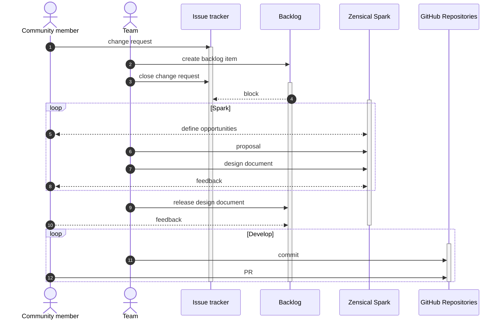

# How we work

We build software with and for our users, shaping strategy, design, and
implementation through continuous collaboration. The aim is to ensure that our
product vision and strategy are always aligned with the needs of our user
community.

To achieve this goal, we have created a model of open development that goes
beyond typical practices in Open Source and aims to create more focused and
high-level discussions that drive the evolution of Zensical.  We also want to
make it easier for people to stay engaged with the project and contribute to it
in meaningful ways. This brings a range of immediate [benefits].

  [benefits]: #benefits

The key elements of our model are a [public roadmap], which outlines the
trajectory of the project, and our [public backlog], which breaks down items
from the roadmap into actionable and achievable tasks. We manage both in
response to input from the community.

Our process is open to a range of contributions and we put mechanisms in place to
actively curate the information we need for decision-making and development as
well as to invite contributions and feedback from the user community at critical
points in time.

  [public roadmap]: https://zensical.org/about/roadmap/
  [public backlog]: https://github.com/orgs/zensical/projects/2

## Change requests and the backlog

Change requests are an important feature of Open Source development. Of course,
we invite community members to submit them via our issue tracker. We promptly
integrate all change requests into a structured, transparent process.

Zensical is a vertically integrated set of systems that support different
aspects of technical writing. It consists of a number of projects, each with its
own repository and published releases. To provide a view of our development
activities overall, we keep our [public backlog] separate, which we use to keep
track of change requests across all projects.

## Process overview

The diagram below outlines the different stages a change request goes through
and several opportunities for community members to contribute to this process.

## Process steps

1. You submit a change request on the issue tracker on one of our repositories.
   The issue template for change requests guides you through the submission
   process and ensures that we receive all the information we need to act on
   your change request.

2. We review your change request and may request further information before we
   create an item in our [public backlog], prioritize it and estimate its impact
   on the wider user base.

     You can then subscribe to backlog items you are interested in to receive
     notifications of status changes. We lock backlog items until we consider
     the item ready for design and implementation. This keeps the notification
     noise to a minimum since you will only receive relevant updates. You can,
     of course, still subscribe to your original change request.

     The backlog items are organized, where possible, into broader topics that
     match items on our [roadmap]. We will set up links between the roadmap and
     the backlog to allow users to navigate from either end.

  [roadmap]: https://zensical.org/about/roadmap

3. We will then close your original change request to ensure that the issue tracker
   remains focused on currently known issues, so that you and others can always
   quickly investigate unexpected behavior.

4. We will also mark your original change request as blocked by the backlog
   item. This way there is a relationship that can be navigated from both ends.
   The backlog is a single point of reference for all repositories and is
   exclusively curated and managed by the Zensical team.

     We encourage community members to always consult the backlog first as we
     are also regularly adding items that do not have their origin in a change
     request but reflect our efforts to move Zensical forward.

5. The separate space that [Zensical Spark] provides helps us to focus on the
   complex requirements and workflows of professional users. While public
   discussions in Open Source projects often circle around specific features and
   implementation details, we use this space to have higher-level discussions
   about the [opportunities] we need Zensical to address, on the unmet needs and
   pain points of people who work with it every day. We also offer private channels
   and NDAs to discuss confidential matters.

  [Zensical Spark]: https://zensical.org/spark/
  [opportunities]: https://zensical.org/spark/methodology/#stage-1-opportunities

6. Once we have established a thorough understanding of the opportunity space,
   we will produce [proposals] for possible solutions. We explore different
   approaches together with our members in Zensical Spark, to ensure that all
   options and trade-offs have been considered.

  [proposals]: https://zensical.org/spark/methodology/#stage-2-proposals

7. From the exploration proposals we distill a [design document] that provides a
   clear definition of the opportunities it addresses, alternative solutions
   that were considered, details of designs, scope, and key implementation
   decisions as well as identified risks and mitigation strategies.

  [design document]: https://zensical.org/spark/methodology/#stage-3-design

8. We elicit feedback from members in Zensical Spark and iterate over the
   process as needed.

9. Design documents will be made available publicly before development starts,
   allowing users to understand upcoming changes and the rationale for them.

10. At this point, we invite the wider community to provide feedback on the
    design documents. We will incorporate feedback (as well as existing
    discussions on your change request) into the process as appropriate.
    To avoid bike-shedding, we will keep discussions within Zensical Spark.

11. Development happens on the public repositories of the Zensical projects. We
    use short-lived feature branches to ensure ongoing development and
    maintenance at the same time, while reducing merge conflicts to a minimum.
    All features will be released as Open Source.

12. Open Source projects thrive if their development is driven by contributions
    from the wider community. We invite contributors to produce pull requests
    after we finish the initial development phase. The established context,
    scope, and constraints are defined by the corresponding design document.

## Benefits

### Transparency

* We make our priorities transparent through the backlog, which serves as a
  single point of reference for the development activities in all Zensical
  projects.

* A tidy issue tracker immediately shows the currently known issues.

* Users can subscribe to the backlog for low-noise notifications of progress on
  items they are interested in.

### Alignment of interests

* By discussing opportunities, proposals, and design choices with our
  professional users, we ensure that we provide degrees of freedom that ensure
  we support both common use cases and edge cases.

* Design documents allow us to invite pull requests not just for bug fixes and
  small-scale contributions but to accept more substantial code contributions,
  guided by a defined context, scope, and constraints.

### Influence

* Change requests remain an important mechanism by which the community can
  influence the direction of an Open Source project.

* Discussions within Zensical Spark organized to elicit contributions from
  groups of users with complex requirements and workflows.

