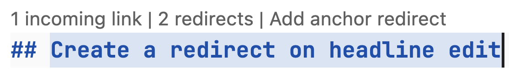

# Redirects

Pages and sections often move as documentation evolves. Redirects keep links
from bookmarks, search results, and other sites working by sending users from
an old URL to its new destination.

## Configuration

Enable the [`redirects` plugin][redirects plugin] and add each old Markdown path
and its new destination to `redirect_maps`. No installation is required. Source
paths and internal destinations must be relative to the [`docs_dir`][docs_dir].
Destinations can also be absolute HTTPS URLs.

=== "`zensical.toml`"

    ``` toml
    [project.plugins.redirects.redirect_maps]
    "old.md" = "new.md"
    ```

=== "`mkdocs.yml`"

    ``` yaml
    plugins:
      - redirects:
          redirect_maps:
            old.md: new.md
    ```

With the default directory-style URLs, the example creates these redirects:

- `/old/` → `/new/`
- `/old/#details` → `/new/#details` (existing fragments are preserved)

Each mapping describes a former URL on the left and its current destination on
the right. Choose the source according to what changed:

- Use a **page path** when a page was renamed, moved, or removed.
- Use a **page path with an anchor** when a heading was renamed or a section
  moved.
- Combine both kinds when one page was split into several pages.

### Automatic redirects

[Zensical Studio] can keep `redirect_maps` aligned when published pages move or
anchors change. It updates references within the project and maintains redirects
from previously published URLs to their current destinations.

When an anchor changes, Studio shows an **Add anchor redirect** CodeLens above
the renamed heading after the change is saved. Select it to preserve the
previously published URL with an anchor redirect, which will create the
necessary redirect in `mkdocs.yml` or `zensical.toml`:

<figure markdown="span">

{ width="557" }

</figure>

The `redirects` plugin and `redirect_maps` must already be configured. Studio
also updates existing redirect destinations when their target changes.

## Usage

### Redirect a page

When a page is renamed, moved, or removed, map its old path to another page as
shown above. The source path describes where the page used to live, so no
Markdown file should remain at the old location.

### Redirect a section

When a heading is renamed, include its old and new anchors in the mapping. The
same form can move a section to another page:

=== "`zensical.toml`"

    ``` toml
    [project.plugins.redirects.redirect_maps]
    "current.md#old-heading" = "current.md#new-heading"
    "guide.md#configuration" = "reference/configuration.md"
    ```

=== "`mkdocs.yml`"

    ``` yaml
    plugins:
      - redirects:
          redirect_maps:
            current.md#old-heading: current.md#new-heading
            guide.md#configuration: reference/configuration.md
    ```

The example creates these redirects:

- `/current/#old-heading` → `/current/#new-heading`
- `/guide/#configuration` → `/reference/configuration/`

### Split a page

When one page is split into several pages, create a page redirect as a fallback
and add anchor redirects for sections with more specific destinations:

=== "`zensical.toml`"

    ``` toml
    [project.plugins.redirects.redirect_maps]
    "old.md" = "overview.md"
    "old.md#installation" = "guides/install.md#linux"
    "old.md#configuration" = "guides/configuration.md"
    "old.md#api" = "reference/api.md"
    ```

=== "`mkdocs.yml`"

    ``` yaml
    plugins:
      - redirects:
          redirect_maps:
            old.md: overview.md
            old.md#installation: guides/install.md#linux
            old.md#configuration: guides/configuration.md
            old.md#api: reference/api.md
    ```

The example creates these redirects:

- `/old/` → `/overview/`
- `/old/#installation` → `/guides/install/#linux`
- `/old/#configuration` → `/guides/configuration/`
- `/old/#api` → `/reference/api/`
- `/old/#unknown` → `/overview/#unknown` (fallback for unmapped anchors)

[docs_dir]: basics.md#docs_dir
[redirects plugin]: ../compatibility/mkdocs/plugins.md#redirects
[Zensical Studio]: https://zensical.org/studio/
