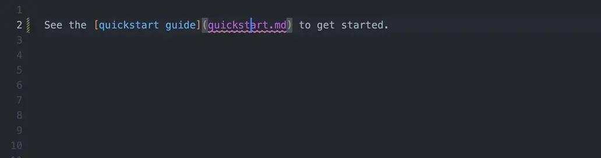

# Validation

Broken links are easy to miss – pages get renamed or moved, and references silently stop working. Zensical validates all internal links at build time by scanning every Markdown file and resolving both inline links and reference-style links. Checks include invalid link anchors.

Additionally, the build can be aborted when issues are found by enabling [strict mode].

<div id="studio" markdown>
!!! tip "Zensical Studio"

    With [Zensical Studio], we are delivering in-editor support for link
    checking and refactorings that update links when headings change or
    when files are renamed or moved. Catch problems like broken links as
    you author, instead of only in a build.

    

    Parsing in Zensical Studio is based on our own Python Markdown parser,
    which enables a host of other improvements in the authoring experience,
    especially navigation and refactorings. We will publish the parser as
    Open Source in the coming months and integrate into Zensical as the new
    basis for validation during builds.
</div>

  [Zensical Studio]: https://zensical.org/studio/


[strict mode]: #strict-mode
[unresolved references]: #unresolved_references

## Configuration

Link validation is enabled by default and you can turn on other checks. Note,
however, that these are deprecated in their current form.

=== "`zensical.toml`"

    ``` toml
    [project.validation]
    invalid_links = true
    invalid_link_anchors = true
    unresolved_references = false
    unresolved_footnotes = false
    unused_definitions = false
    unused_footnotes = false
    shadowed_definitions = false
    shadowed_footnotes = false
    ```

=== "`mkdocs.yml`"

    ``` yaml
    validation:
      invalid_links: true
      invalid_link_anchors: true
      unresolved_references: false
      unresolved_footnotes: false
      unused_definitions: false
      unused_footnotes: false
      shadowed_definitions: false
      shadowed_footnotes: false
    ```

Validation can also be completely disabled:

=== "`zensical.toml`"

    ``` toml
    [project]
    validation = false
    ```

=== "`mkdocs.yml`"

    ``` yaml
    validation: false
    ```

### `invalid_links`

Warn when a link points to a page that does not exist.

=== "`zensical.toml`"

    ``` toml
    [project.validation]
    invalid_links = true
    ```

=== "`mkdocs.yml`"

    ``` yaml
    validation:
      invalid_links: true
    ```

__Example__

``` markdown title="index.md"
Oh no, [this page] does not exit.

[this page]: non-existent.md
```

<div class="result" markdown>
``` console
$ zensical build
...
Warning: page does not exist
   ╭─[ index.md:3:14 ]
   │
 3 │ [this page]: non-existent.md
   │              ───────┬───────
   │                     ╰───────── page does not exist
───╯
```
</div>

---

### `invalid_link_anchors`

Warn when a link points to an anchor that does not exist.

=== "`zensical.toml`"

    ``` toml
    [project.validation]
    invalid_link_anchors = true
    ```

=== "`mkdocs.yml`"

    ``` yaml
    validation:
      invalid_link_anchors: true
    ```

__Example__

``` markdown title="index.md"
Oh no, [this section] does not exit.

[this section]: page.md#non-existent
```

<div class="result" markdown>
``` console
$ zensical build
...
Warning: anchor does not exist
   ╭─[ index.md:3:31 ]
   │
 3 │ [this section]: page.md#non-existent
   │                         ──────┬─────
   │                               ╰─────── anchor does not exist
───╯
```
</div>

### Deprecated checks

The following checks have been deprecated in their current form. While they do
work in most cases, they turned out to have too many edge cases that the
approach taken could not cover.  You can still use them in your projects but be
aware that we will replace them with functionally equivalent ones once we
publish our Python Markdown parser and integrate it with Zensical. It already
powers [Zensical Studio](#studio), which we recommend you use to get direct
feedback and functionality to avoid links breaking in the first place.

---

#### `unresolved_references`

Warn when a link or image reference has no matching definition.

=== "`zensical.toml`"

    ``` toml
    [project.validation]
    unresolved_references = true
    ```

=== "`mkdocs.yml`"

    ``` yaml
    validation:
      unresolved_references: true
    ```

__Example__

``` markdown title="index.md"
This is an [unresolved reference][id].
```

<div class="result" markdown>

``` console
$ zensical build
...
Warning: unresolved link reference
   ╭─[ index.md:1:35 ]
   │
 1 │ This is an [unresolved reference][id].
   │                                   ─┬
   │                                    ╰── unresolved link reference
───╯
```

</div>

---

#### `unresolved_footnotes`

Warn when a footnote reference has no matching definition.

=== "`zensical.toml`"

    ``` toml
    [project.validation]
    unresolved_footnotes = true
    ```

=== "`mkdocs.yml`"

    ``` yaml
    validation:
      unresolved_footnotes: true
    ```

__Example__

``` markdown title="index.md"
This is an unresolved footnote[^id].
```

<div class="result" markdown>

``` console
$ zensical build
...
Warning: unresolved footnote reference
   ╭─[ index.md:1:33 ]
   │
 1 │ This is an unresolved footnote[^id].
   │                                 ─┬
   │                                  ╰── unresolved footnote reference
───╯
```

</div>

---

#### `unused_definitions`

Warn when a link definition is never referenced.

=== "`zensical.toml`"

    ``` toml
    [project.validation]
    unused_definitions = true
    ```

=== "`mkdocs.yml`"

    ``` yaml
    validation:
      unused_definitions: true
    ```

__Example__

``` markdown title="index.md"
[id]: https://example.com
```

<div class="result" markdown>
``` console
$ zensical build
...
Warning: unused link definition
   ╭─[ index.md:1:2 ]
   │
 1 │ [id]: https://example.com
   │  ─┬
   │   ╰── unused link definition
───╯
```
</div>

---

#### `unused_footnotes`

Warn when a footnote definition is never referenced.

=== "`zensical.toml`"

    ``` toml
    [project.validation]
    unused_footnotes = true
    ```

=== "`mkdocs.yml`"

    ``` yaml
    validation:
      unused_footnotes: true
    ```

__Example__

``` markdown title="index.md"
[^id]: This footnote is never referenced.
```

<div class="result" markdown>
``` console
$ zensical build
...
Warning: unused footnote definition
   ╭─[ index.md:1:3 ]
   │
 1 │ [^id]: This footnote is never referenced.
   │   ─┬
   │    ╰── unused footnote definition
───╯
```
</div>

---

#### `shadowed_definitions`

Warn when a link definition is declared more than once.

=== "`zensical.toml`"

    ``` toml
    [project.validation]
    shadowed_definitions = true
    ```

=== "`mkdocs.yml`"

    ``` yaml
    validation:
      shadowed_definitions: true
    ```

__Example__

``` markdown title="index.md"
This [reference][id] has two definitions.

[id]: https://example.com/shadowed
[id]: https://example.com
```

<div class="result" markdown>
``` console
$ zensical build
...
Warning: shadowed link definition
   ╭─[ index.md:3:2 ]
   │
 3 │ [id]: https://example.com/shadowed
   │  ─┬
   │   ╰── shadowed link definition
───╯
```
</div>

---

#### `shadowed_footnotes`

Warn when a footnote definition is declared more than once.

=== "`zensical.toml`"

    ``` toml
    [project.validation]
    shadowed_footnotes = true
    ```

=== "`mkdocs.yml`"

    ``` yaml
    validation:
      shadowed_footnotes: true
    ```

__Example__

``` markdown title="index.md"
This footnote[^id] has two definitions.

[^id]: 1st definition
[^id]: 2nd definition
```

<div class="result" markdown>
``` console
$ zensical build
...
Warning: shadowed footnote definition
   ╭─[ index.md:3:3 ]
   │
 3 │ [^id]: 1st definition
   │   ─┬
   │    ╰── shadowed footnote definition
───╯
```
</div>

---

## Usage

Just you write your content as usual, and Zensical will automatically validate all links and footnotes at build time.

If issues are found, a warning is emitted with the file name, line number, and a helpful message.

### Escaping

If you want to intentionally wrap a phrase with brackets without creating a link, you can escape the opening bracket with a backslash, i.e., `\[`. The closing bracket does not need to be escaped:

``` markdown
This is not a \[link](https://example.com).
```

While escaping is technically not necessary when no link definition is present, it is recommended to avoid accidentally creating a link when a definition is later added.

Moreover, link validation assumes that bracketed phrases are intended to be links or footnotes, so it will emit warnings for any unresolved references or unused definitions. Escaping allows you to avoid these warnings and clearly indicate that the brackets are not meant to create a link.

### Strict mode

If you want to enforce link validation and fail the build when issues are found, you can enable strict mode by using the `--strict` command-line option:

``` markdown title="index.md"
This is an [unresolved reference][id].
```

<div class="result" markdown>

``` console
$ zensical build --strict
...
Warning: unresolved link reference
   ╭─[ index.md:1:35 ]
   │
 1 │ This is an [unresolved reference][id].
   │                                   ─┬
   │                                    ╰── unresolved link reference
───╯
1 issue found
Aborted because --strict flag is set
```

</div>

The build is aborted after reporting all issues, and the exit code is set to `1` to indicate failure. This can be useful in CI/CD pipelines to ensure that all links are valid before deploying the site.
